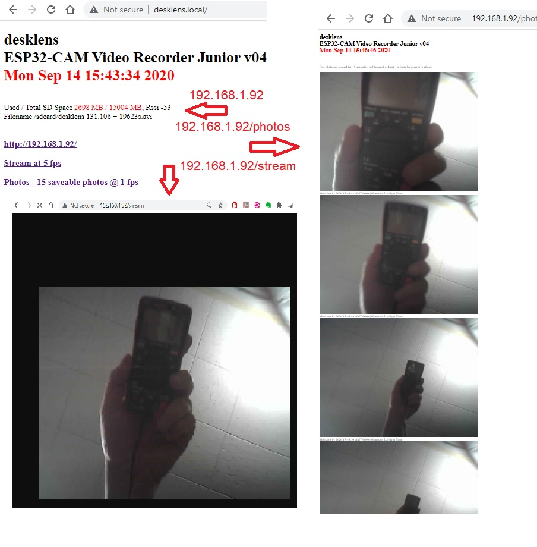

# ESP32-CAM-Video-Recorder-junior
Simple fast version of ESP32-CAM-Video-Recorder

ESP32-CAM-Video-Recorder-junior

  This program records an mjpeg avi video to the sd card of an ESP32-CAM.
  
  You can just compile, download, power-on ... and it will record a series of 3 minute, SVGA videos on your SD card ... while you read on ...

## Update Sep 13, 2020 - adding complexity
v02 - basic version
 
v04 - added wifi, time, stream @ 5 fps, and photos @ 1 fps
 - you need to add your wifi ssid and password below  
 - if you walk away from your wifi, then wifi wont work, but recording continues
 - if you are away from wifi at boot time, it wont have wifi, but you will record the events of January 1970
 - the main web page just shows your available disk space, and your wifi signal strengh, deleting lots of stats from the other version
 - the stream function shows a moving picture in one window, that you can watch or record on your computer using VLC etc.  With bad wifi, you could slow the 5 fps to 1 or 2 fps, by replacing the delay(200) with a longer delay 
 - the photos function shows a series of photos 1 second apart for 15 seconds, that you can scroll through on your web browser and save a jpg, or refresh for another 15 second group
 - both the streaming and the photos use the same images that are stored in the avi file, so it should not affect the frame-rate of the recording on the sd, but you might see partial images if you have slow wifi and the sd writer deletes the image while it it being transmitted.  Let me know of problems in the comments. :smiley:
 
 v04a - bugfix to the streaming when used in poor wifi situations
 - more stats on the webpage to keep track of fps
 

 ## Original Sep 12, 2020 
 
  by James Zahary Sep 12, 2020
     jamzah.plc@gmail.com

  https://github.com/jameszah/ESP32-CAM-Video-Recorder-junior
  
  https://github.com/jameszah/ESP32-CAM-Video-Recorder

    jameszah/ESP32-CAM-Video-Recorder is licensed under the
    GNU General Public License v3.0

    jameszah/ESP32-CAM-Video-Recorder-junior is licensed under the
    GNU General Public License v3.0

  The is Arduino code, with standard setup for ESP32-CAM
    - Board ESP32 Wrover Module
    - Partition Scheme Huge APP (3MB No OTA)

  It is the junior version of   https://github.com/jameszah/ESP32-CAM-Video-Recorder
  which has 100 other features of wifi, streaming video, http control, telegram updates, pir control,
  touch control, ftp downloads, .... and other things that make it very big and complex.

  This one is written in simple arduino code without any semaphores, tasks, priorities, RTOS stuff ....

  Just set 4 parameters, compile and download, and it will record on power-on, until sd is full, or power-off.
  Then pull out the sd and move it to your computer, and you will see all but the last file avi which died during the unplug.

  Update:  I added some complexity.
     Connect Pin 12 to GND to stop a video -- no dead videos -- and prevent recording.
     Release Pin 12 and it will record forever.

  Compile Time Parameters
  1.  framesize 10,9,7,6,5: 
  
    10 - UXGA (1600x1200 @ 6 fps), 
    9 - SXGA (1280x1024 @ 6 fps), 
    7 - SVGA(800x600 @ 24 fps), 
    6 - VGA(640x480 @ 24 fps), 
    5 - CIF(400x296 @ 50 fps)
  2.  quality - 1 to 63 - 10 is a good start, increase to 20 to get more frames per second - must be higher than jpeg_quality below
  3.  avi_length - seconds for each avi - it closes files, and starts another file after this time - like 60 or 1800
  4.  devname - a text name for your camera when the files are on your computer

  Note that framesize and high quality will produce lots of bytes which have to written to the sd.  Those frame rates above are
  for the OV2640 camera, and your sd card will have to be able to swallow all that data before the next frame.  If the
  sd card cannot take all that data, then the camera will be idle waiting for the sd.  Lower the framesize (UXGA -> SVGA),
  and lower the quality (10 -> 15 -> 20, higher number is lower quality) to improve framerate to the camera limits.
  If you have a fast enough sd card, it will record at the full speed of the camera.

  Using a Lexar 633x circle10, U3, V30 SD card, with quality set at 20, it will record at full speed of the camera -- in dull indoor light.
  In bright outdoor light - looking at the sun - it will slow down by half - to about 12 fps SVGA.  You could lower quality to keep that
  at a higher fps, if you insist on looking at the sun.

  Using a dollarstore SD card - EAGET circle10, U1 - it will record at about half of the camera capacity -- in dull indoor light.

  You can look at the blinking red led on the back of the chip to see the recording rate -- sd chips for video are made to be more predictable.

  The files will have the name such as:

    desklens 10.3 + 120s.avi

    "desklens" is your devname
    10 - is a number stored in eprom that will increase everytime your device boots
    3 - is the 3rd file created during the current boot
    +120s - is an indictation of how long since we started recording on this boot
          - this is the 3rd file, and started 120 seconds after the boot, so the files must be 60 seconds long

  Small red led on the back blinks with every frame.

