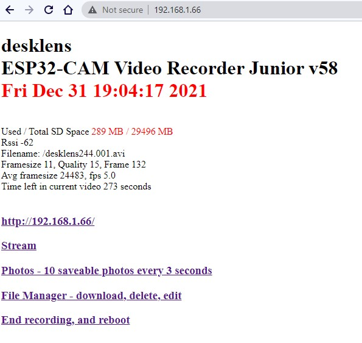
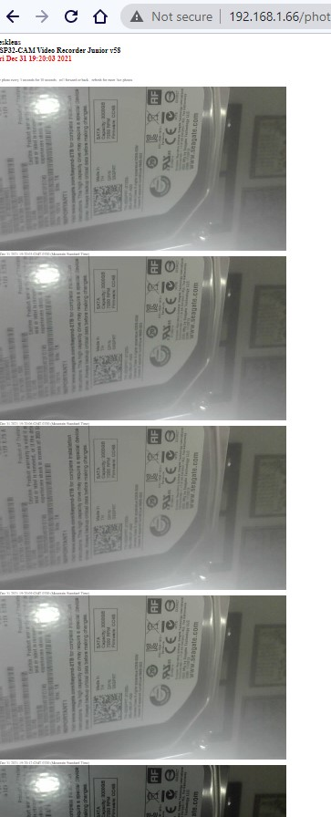
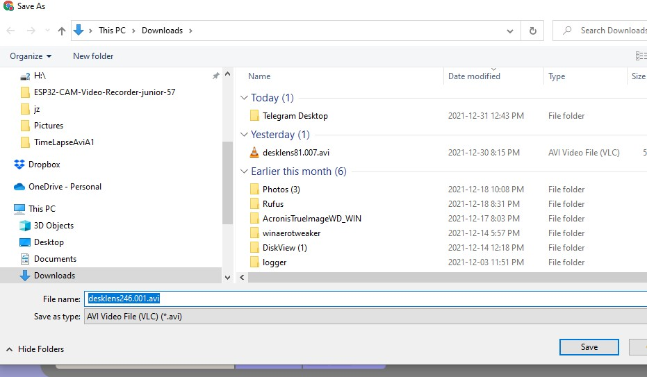
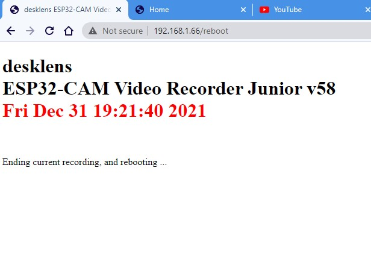
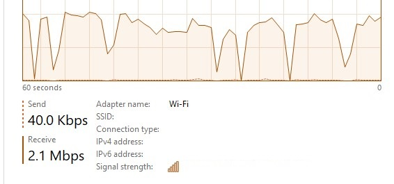
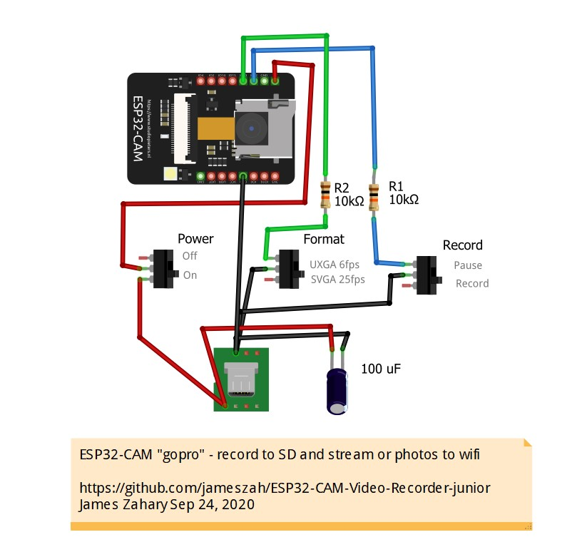
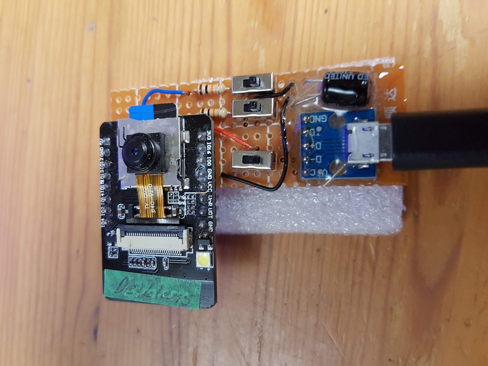

# ESP32-CAM-Video-Recorder-junior
Simple fast version of https://github.com/jameszah/ESP32-CAM-Video-Recorder

ESP32-CAM-Video-Recorder-junior

  This program records an mjpeg avi video to the sd card of an ESP32-CAM.
  
  You can just compile, download, power-on ... and it will record a series of 30 minute, HD videos, 12.5 fps on your SD card ... while you read on ... 
  
  Although if you put your ssid and password, and timezone into the config.txt file, and put that file on the SD card, things will be nicer!  You can read the comments in config.txt and set your desired recording length, framesize, and internet on/off in there.

## Update Feb 25, 2025

New version in v62 folder
Some updates
- allows 2 router ssid, and it will choose the best
- keeps AP access point running, so you can use it without a router and access from phone
- files access downloads and sorted and organized better
- allows you to look inside the videos, and click to various points to check this is the video you want to download
- allows you to re-index a video on the sd card, so you can look at it, and download the indexed version (in event of dead battery or other problem, that did not close file properly)
- has ota enabled by endpoint 192.168.1.100/ota etc with password "mrpeanut"
- has endpoint 192.168.1.100/capture to set up a motioneye Network Camera independent of local recording
- gets rid of requirement to have 4MB esp32-cam's as some generic versions just have 2MB
- endpoints 192.168.1.100:81/stream and 192.168.1.100:82/stream for 2 streaming channels
- endpoints 192.168.1.100/stop and 192.168.1.100/start to stop start recording from web (starts recording on reboot)
- ground/unground gpio 12 to stop/start recording with a switch or pir, etc
- gpio 12 "stop" supercedes web-stop above
- lots of efficiency improvments
- will add a one-click installer
- run on clean sd card and it will create a default config2.txt file and start an access point at "desklens", password "12344321", then 192.168.4.1, and click "edit config2.txt" to put you own ssid, timezone, recording parameters
- set board type as AI-Thinker ESP32-CAM with Minimum Spiffs 1.9MB with ota, etc

## Star History

Check out https://github.com/jameszah/ESP32-CAM-JAMCAM with builtin video clipping, reduce framerate, and rebuild index, plus video display, ... and snakes!

## Update Jan  7, 2021 - One-Click Installer

Click here for a one-click installer of the current version of the program.  It is pre-compiled, and it will run with no-internet, and the standard HD recording, or you can edit the config.txt and put it on a sd card, and then wifi will start and you can watch streaming video, and download your videos to your browser and computer/phone.

https://jameszah.github.io/ESP32-CAM-VideoCam/

## Update Jan  2, 2021 - updates for Arduino 1.8.19 and esp32-arduino 2.0.2

You need all the files from the v58 folder:   
https://github.com/jameszah/ESP32-CAM-Video-Recorder-junior/tree/master/v58  

esp32-arduino 2.0.2 busted a few things (mutexes, some sd_mmc chnages)  
Obviously, you need the wifi running for all these wifi features - but you can do the simple recording with switch control without the wifi.

The main screen is the same, except for the link to the esp32_sd_file_manager to download or edit the avi's and config.txt.

Then there is the streaming screen (not shown) and the photos screen below - you can 10 photos at 3 second intervals.

This is the esp32_sd_file_manager_screen:  
1.  SD space and used space
2.  GOTO ROOT DIR - takes you to the root
3.  Folders are white - click on it to enter that folder
4.  Files are blue/orange - click on the file to download it to your browser / computer
5.  "D" "R" and "E" to delete, rename, or edit the files - only edit text files
6.  Download all files to get the entire folder shown (not the sub folders)
7.  You can also upload files in the "File Drop Zone"
Read more about it here https://github.com/jameszah/ESPxWebFlMgr/tree/master/esp32_sd_file_manager

This system will download to Windows and Android, and presumably others.  

There is a problem with Android downloading to the browser in a Sansumg phone - it saves the .avi file with a ".phps" file type.  You can delete that and it will be recongnized as an .avi and will play properly, but I don't know where the "phps" comes from. ???  

(Jan 12, 2022 - add date and time to files)  

Here is the download file dialog on Windows.

You can also end recording and reboot from the webpage.

Under good conditions, you can download at about 2 Mbps while recording, 3 Mbps when not recording,
from an esp32 max of about 3.5 Mbps.

## Update Dec 28, 2021 - new version with http browser file tranfer to download movies 

You need all the files from the v57 folder:   
https://github.com/jameszah/ESP32-CAM-Video-Recorder-junior/tree/master/v57  
Using this library to transfer files to your computer or phone:   
https://github.com/jameszah/ESPxWebFlMgr/tree/master/esp32_sd_file_manager

Stay tuned for instructions.

---
  
  Here is a timelapse sample, recorded and uploaded to Youtube.  The settings were framesize UXGA (13), quality 15, 1 fps, 1800 seconds long, speedup 30 times.  Click the image and it will take you to Youtube to see it.
  

Here is a realtime sample, recorded and uploaded to Youtube.  The settings were framesize HD (11), quality 14, max fps or zero interval, 30 seconds long, speedup 1 times.  It came out at about 12.4 fps. Lowering the quality slightly -- higher quality number -- will make the bytes per frame smaller, and keep the speed at the camera maximum of 12.5 fps for HD.  Click the image and it will take you to Youtube to see it.

## Update Jun 10, 2021 - new program to check out

It records a video and sends it to your Telegram account - no SD card!

https://github.com/jameszah/ESP32-CAM-Video-Telegram

## Update May 13, 2021 - v50lpmod for Arduino 1.8.13, and esp32-arduino core 1.06 - mod to fix broken jpeg
This is the same as the last version with a small mod to fix the broken jpeg problem.  The critical line is here:

esp_err_t set_ps = esp_wifi_set_ps(WIFI_PS_NONE);

It sets the modem to no power saving.  The power saving had put the modem to sleep for a time, and when it awoke, it caused a disturbance in the i2s system (my theory), that caused the i2s camera to become confused, and create a bad jpeg.

Read more here for my journey to this solution (2-3 months I think!)

https://github.com/espressif/esp32-camera/issues/244#issuecomment-831561336

## Update Apr 19, 2021 - v50 for Arduino 1.8.13, and esp32-arduino core 1.06
Updated version I have been using.

Uses the current Arduino IDE 1.8.13, and the current esp32-arduino core 1.06, which handles the ov5640 camera in additon to the normal ov2640.

Framerates have improved - the ov2640 will record at 12.5 fps on regular HD 1280x720.

Also you can put a config file onto the SD card, called config.txt which will set all the parameters of the recording.  See the config.txt file included here.  So you can compile and install the version here, and then control everything by editing config.txt on the SD card.  Much simpler even if you are working at your dev computer.

You can run full-speed at any framesize and quality, or timelapse, and stream or not stream as desired.

There is a issue with the esp32 camera and wifi that interact, so when the wifi is turned on, you will have an occasional broken frame -- one frame of the movie that will look odd.  If you shut off the wifi, it should be perfect.

The config.txt has parameters to run without wifi, or start wifi to get the current time and then shut off, or use WiFi-Man wifi with streaming, or use WiFi ssid from the config file, and have it controlled with the pin 13 switch, to switch it on to look through the viewfinder, then switch it off to get a perfect recording.

Ground pin 12, so stop recording.  And ground pin 13 to enable disable wifi, using the same hardware defined below.

Has the file delete code included, so it will delete old videos as long as the camera is running.

Also, this has tasks and mutexes and priorities, in defiance of the original design.  All that makes sure that the camera and the sd and the wifi, can all operate at full speed without blocking each other.  You can record the streaming video with VLC on your coomputer if you like.

## Update Jan 04, 2021 - Streaming GOPRO with WiFiManager 
v10x-wifiman - added WiFiManager to set your wifi ssid and password using your phone
 - use the normal WiFiManager procedure to set up ssid with 192.168.4.1 etc
 https://github.com/tzapu/WiFiManager
 
 You must use the latest WiFiManager code which supports the ESP32 - currently 2.0.3-alpha which can be installed from Arduino IDE - Manage Libraries. And you must reboot the esp32 after you have set the ssid.
 
 Some other new stuff in the comments - a version that adds back the ftp, and a version that slows down the recording for timelapses, or just lower framerates to save SD card space.
 

https://github.com/jameszah/ESP32-CAM-Video-Recorder-junior/blob/master/ESP32-CAM-Video-Recorder-junior-10x.wifiman.ino

## Update Sep 28, 2020 - ESP32-CAM "GOPRO"
v10 - fast and just one version

- default is no internet, and record at SVGA at 25 fps, quality 10, and series of 30 minute videos
- add IncludeInternet to 1, and put in your ssid and password, to get live streaming
- add switches to pin 12 and 13, if you want to stop recording, or switch to another configuration -- no software changes required
- if you ground pin 12, recording will stop
- if you ground pin 13, the next video will be UXGA 6 fps, quality 10, 30 minutes -- or change in the code if you like
- old files in the /old folder

## Update Sep 24, 2020 - ESP32-CAM "gopro"
v09 - faster version - controlled by switches

- the Internet is shut off by default, so you #define IncludeInternet to 1, and put in your ssid and password
- if you have no switches attached to gpio12 and gpio13, then they will not be grounded and it will "record" and "svga 25fps"
- at SVGA 25fps, quality 12 in the sunshine, you get files of 1.5 GB per 30 minutes - so reduce quality, switch to lower framesize, or go to the timelapse system of 1 frame per second or 10 frames per second, etc to get smaller files
- these are mjpeg avi files, so each frame is an independent jpeg, so you can extract them all, but you do not get the size benefits of h264 or xvid, etc 
- the pictures below show how to see streaming video, or a series of frames on your browser
- filenames are now "desklens10.003.avi" so they are easy to deal with.  "desklens" is your device name, 10 is the 10th boot of your device, and 003 is the 3rd file made during this boot

## Update Sep 20, 2020 - very fast
v07 - faster version - should operate at full speed of camera
 - internet shut off by default -- edit define to 1, then ssid and pass
  - default is svga, quality 10, 5 minute video -- 25 fps and realtime
  - this make files about 80 MB per minute, so 200 minutes for 16GB chip
  - lower the quality to get smaller files! (lower quality = higher number)

## Update Sep 13, 2020 - adding complexity
v02 - basic version
 
v04 - added wifi, time, stream @ 5 fps, and photos @ 1 fps
 - you need to add your wifi ssid and password below  
 - if you walk away from your wifi, then wifi wont work, but recording continues
 - if you are away from wifi at boot time, it wont have wifi, but you will record the events of January 1970
 - the main web page just shows your available disk space, and your wifi signal strengh, deleting lots of stats from the other version
 - the stream function shows a moving picture in one window, that you can watch or record on your computer using VLC etc.  With bad wifi, you could slow the 5 fps to 1 or 2 fps, by replacing the delay(200) with a longer delay 
 - the photos function shows a series of photos 1 second apart for 15 seconds, that you can scroll through on your web browser and save a jpg, or refresh for another 15 second group
 - both the streaming and the photos use the same images that are stored in the avi file, so it should not affect the frame-rate of the recording on the sd, but you might see partial images if you have slow wifi and the sd writer deletes the image while it it being transmitted.  Let me know of problems in the comments. :smiley:
 
 v04a - bugfix to the streaming when used in poor wifi situations, and more stats on webpage to track fps
 

 ## Original Sep 12, 2020 
 
  by James Zahary Sep 12, 2020
     jamzah.plc@gmail.com

  https://github.com/jameszah/ESP32-CAM-Video-Recorder-junior
  
  https://github.com/jameszah/ESP32-CAM-Video-Recorder

    jameszah/ESP32-CAM-Video-Recorder is licensed under the
    GNU General Public License v3.0

    jameszah/ESP32-CAM-Video-Recorder-junior is licensed under the
    GNU General Public License v3.0

  The is Arduino code, with standard setup for ESP32-CAM
    - Board ESP32 Wrover Module
    - Partition Scheme Huge APP (3MB No OTA)

  It is the junior version of   https://github.com/jameszah/ESP32-CAM-Video-Recorder
  which has 100 other features of wifi, streaming video, http control, telegram updates, pir control,
  touch control, ftp downloads, .... and other things that make it very big and complex.

  This one is written in simple arduino code without any semaphores, tasks, priorities, RTOS stuff ....

  Just set 4 parameters, compile and download, and it will record on power-on, until sd is full, or power-off.
  Then pull out the sd and move it to your computer, and you will see all but the last file avi which died during the unplug.

  Update:  I added some complexity.
     Connect Pin 12 to GND to stop a video -- no dead videos -- and prevent recording.
     Release Pin 12 and it will record forever.

  Compile Time Parameters
  1.  framesize 10,9,7,6,5: 
  
    10 - UXGA (1600x1200 @ 6 fps), 
    9 - SXGA (1280x1024 @ 6 fps), 
    7 - SVGA(800x600 @ 24 fps), 
    6 - VGA(640x480 @ 24 fps), 
    5 - CIF(400x296 @ 50 fps)
   
  2.  quality - 1 to 63 - 10 is a good start, increase to 20 to get more frames per second - must be higher than jpeg_quality below
  3.  avi_length - seconds for each avi - it closes files, and starts another file after this time - like 60 or 1800
  4.  devname - a text name for your camera when the files are on your computer

  Note that framesize and high quality will produce lots of bytes which have to written to the sd.  Those frame rates above are
  for the OV2640 camera, and your sd card will have to be able to swallow all that data before the next frame.  If the
  sd card cannot take all that data, then the camera will be idle waiting for the sd.  Lower the framesize (UXGA -> SVGA),
  and lower the quality (10 -> 15 -> 20, higher number is lower quality) to improve framerate to the camera limits.
  If you have a fast enough sd card, it will record at the full speed of the camera.

  Using a Lexar 633x circle10, U3, V30 SD card, with quality set at 20, it will record at full speed of the camera -- in dull indoor light.
  In bright outdoor light - looking at the sun - it will slow down by half - to about 12 fps SVGA.  You could lower quality to keep that
  at a higher fps, if you insist on looking at the sun.

  Using a dollarstore SD card - EAGET circle10, U1 - it will record at about half of the camera capacity -- in dull indoor light.

  You can look at the blinking red led on the back of the chip to see the recording rate -- sd chips for video are made to be more predictable.

  The files will have the name such as:

    desklens 10.3 + 120s.avi

    "desklens" is your devname
    10 - is a number stored in eprom that will increase everytime your device boots
    3 - is the 3rd file created during the current boot
    +120s - is an indictation of how long since we started recording on this boot
          - this is the 3rd file, and started 120 seconds after the boot, so the files must be 60 seconds long

  Small red led on the back blinks with every frame.

